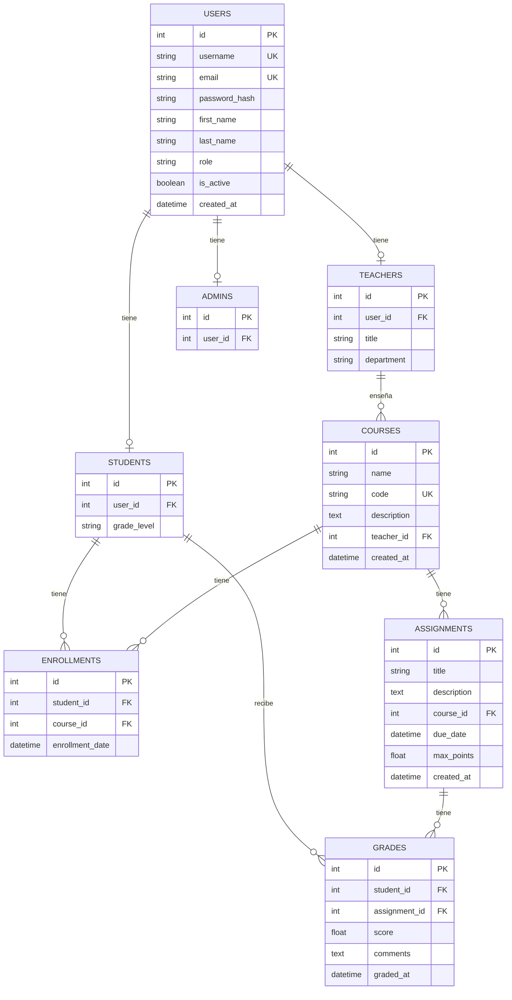

# Diagrama Entidad-Relación de EduGrade

## Descripción de las tablas

1. **USERS**: Almacena la información básica de todos los usuarios del sistema, independientemente de su rol.
2. **TEACHERS**: Contiene información específica de los profesores, relacionada con un usuario.
3. **STUDENTS**: Contiene información específica de los estudiantes, relacionada con un usuario.
4. **ADMINS**: Contiene información específica de los administradores, relacionada con un usuario.
5. **COURSES**: Almacena la información de los cursos ofrecidos, asignados a un profesor.
6. **ENROLLMENTS**: Tabla de relación que registra la inscripción de estudiantes en cursos.
7. **ASSIGNMENTS**: Contiene las tareas o asignaciones que pertenecen a un curso específico.
8. **GRADES**: Almacena las calificaciones que los estudiantes reciben en las asignaciones.

## Relaciones principales

- Un usuario puede ser un profesor, un estudiante o un administrador (relación 1:0..1).
- Un profesor puede enseñar múltiples cursos (relación 1:N).
- Un estudiante puede inscribirse en múltiples cursos a través de la tabla de enrollments (relación M:N).
- Un curso puede tener múltiples asignaciones (relación 1:N).
- Un estudiante recibe calificaciones para asignaciones específicas (relación M:N a través de la tabla grades).

Este modelo de datos soporta todas las funcionalidades del sistema educativo, incluyendo la gestión de usuarios con diferentes roles, cursos, inscripciones, asignaciones y calificaciones.